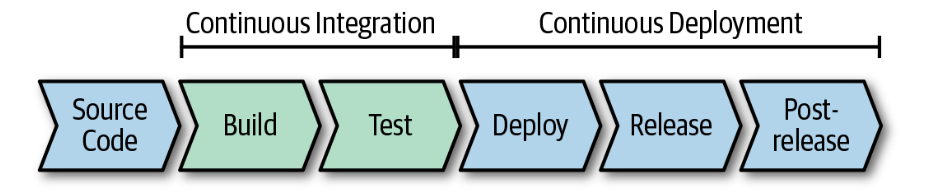

### Chap 1. Introduction to Cloud Native

- A distributed system is a system in which individual computers are connected through a network and appear as a single computer.
	- Network is not so reliable every time and network failure needs to be consider.
	- Latency needs to be considered in case of distributed systems world.
	- There is limited network bandwidth and its not infinite.
	- network is not secure at all.
	- The topology is not static at all in case of distributed computing.
	- There is no any single administrator in case of cloud native distributed systems.

- CAT Theorem
	- Consistency, Availability vs. Isolation

- The Twelve-Factor App
	- The Twelve-Factor app methodology can be considered the foundation for cloud native applications and was first introduced by engineers at Heroku.
	1. Codebase
		- One codebase tracked in revision control; many deploys.
	2. Dependencies
		- Explicitly declare and isolate dependencies.
	3. Configuration
		- Store configuration in the environment.
	4. Backing Services
		- Treat backing services as attached resources.
	5. Build, Release, Run
		- Strictly separate build and run stages.
	6. Processes
		- Execute the app in one or more stateless processes.
	7. Data Isolation
		- Each service manages its own data.
	8. Concurrency
		- Scale out via the process model.
	9. Disposability
		- Maximize robustness with fast startup and graceful shutdown.
	10. Dev/Prod Parity
		- Keep development, staging and production as similar as possible.
	11. Logs
		- Treat logs as event streams.
	12. Admin processes
		- Run admin and management tasks as one-off processes.

- SLAs are important and defined in terms of 9s availability.

### Chap 2. Fundamentals

- Containers
	- The initial idea of containers was to slice up an OS so that you can securely run multiple applications without them interfering with one another.
	- The required isolation is accomplished through namespaces and control groups, which are linux kernal features.
	- Containers are encapsulated, individually deployable components running as isolated instances on the same kernal with virtualization happening on the OS level.
	- Container uses copy-on-write file system to share data across multiple containers.
	- VM isolation softwares and available famous isolation software provided by famous public cloud providers.

- Container Orchestration
	- Container orchestration is needed on large scale container architecture and in those case, management of those many no. of containers become very difficult that's when container orchestrator comes to save our life and by far the most famous tool for that is K8s.

- Kubernetes Overview
	- Kubernetes master node components :
		- kube-apiserver
		- etcd
		- kube-scheduler
		- kube-controller-manager
		- cloud-controller-manager
	- Kubernetes node components :
		- kubelet
		- kube-proxy
		- container runtime
	- Fundamental concepts of k8s : 
		- Pods
		- Services
		- Replica Sets
		- Deployments

- Kubernetes and Containers
	- CRI - Container Runtime interface, deals with the runtime support for container life cycle in k8s
	- OCI - The OCI is a Linux foundation project that aims to design open standards for container images and runtimes.

- Serverless Computing
	- Serverless computing means that scale and the underlying infrastructure is managed by the cloud provider; that is your application automatically drives the allocation and deallocation of resources and you do not need to worry about managing the underlying infrastructure at all.
	- it works based on event driven programming model & pay only per execution model.

- Functions
	- When talking about functions, people typically talk about FaaS offerings such as AWS Lambda, Azure Functions, and Google cloud functions, which are implemented on serverless infrastructure.
	- From a development perspective, a function is the unit of work, which means that your code has a start and a finish. Functions are usually triggered by events that are emitted by either other functions or platform services.
	
- Faas Vs. Containerized Services

| FaaS                              | Containerized Services                     |
| --------------------------------- | ------------------------------------------ |
| Does one thing                    | Does more than one thing                   |
| Can't deploy dependencies         | Can deploy dependencies                    |
| Must respond to one kind of event | Can respond to more than one kind of event |
- There are multiple open source FaaS platforms available for use which can be deployed as container or in containerized environment and use it.
- IaaS to PaaS modernization of applications in the cloud native environment
- Containers are the great way for IT software evaluation over a time and its game changer.
- There are 2 methods to move from monolithic to microservices :
	1. Strangler pattern
		- With this pattern you strangle the monolithic application. New services or existing components are implemented as microservices. A facade or gateway routes user requests to the correct application. Over time, more and more features are moved to the new architecture until the monolithic application has been entirely transformed into a microservices application.
	2. Anticorruption layer pattern
		- This is similar to the strangler pattern but is used when new services need to access the legacy application. the layer then translates the concepts from existing app to new, and vice versa.
- k8s and service meshes became really popular and supports out of the box features.
- CaaS - Container as a service is also became more popular in cloud native environment.
- Benefits of a Microservices Architecture
	- Agility
	- Continuous Innovation
	- Evolutionary design
	- Small, focused teams
	- Fault isolation
	- Improved scale and resource usage
	- Improved observability
- Challenges with a Microservices Architecture
	- Complexity
	- Data Integrity and consistency
	- Performance
	- Development and testing
	- Versioning and integration
	- Monitoring and logging
	- Service dependency management
	- Availability
- Every application, whether cloud native or traditional, needs infrastructure on which to be hosted, technology that addresses pain points with development and deployment, and an architectural style that helps with achieving the business objectives, such as time to market. The goal of this chapter was to provide the basic knowledge for cloud native applications. By now you should understand that there are various container technologies with different isolation levels, how functions relate to containers, and that serverless infrastructure does not always need to be FaaS. Further, you should have a basic understanding of microservices architectures and of how you can migrate and modernize an existing application to be a cloud native application.

### Chap 3. Designing Cloud Native Applications

- A good way to designing cloud native applications is to consider five key areas when starting with the initial design: operational excellence, security, reliability, scalability and cost.
- Operational Excellence
	- Operational excellence means tbat you need to factor in how to run your application. monitor it and improve it over time when you are starting to design.
	- Automate Everything
		- Cloud automation goes hand in hand with infrastructure as Code (IaC). This enables you to minimize errors during environment provisioning and application deployment because the entire environment management is being defined using code artifacts.
		- Azure Resource Manager and AWS cloud formation with Hashicorp's terraform are few good IAC providers.
		- Besides automating how to provision the environment, you also need to automate the entire deployment process of your application.
	- Monitor Everything
		- Monitoring allows you to learn not only about your application and environment behaviour, but also how your application is being used.
	- Document everything
		- It is very common that cloud native applications are being built by many teams and in cloud native distributed environment its always needed to have a well documented APIs using swagger and other automated tools.
	- Make incremental changes
		- When making changes to both the environment as well as the application, you need to ensure that those changes are increamental and reversible.
	- Design for failure
		- Failures in the cloud will happen - period. you need to think not only about how to design your application to survive failures, but also about the processes that need to kick in when something goes wrong.
- Security
	- cloud native environment needs to be super safe and should follow defense in depth principle for security at each and every level.
	- Source code repository should be super secure and you should have CI step for vulnerability checks.
	- Container image scan for ports and RBAC needs to be enabled for private container repository.
	- K8s cluster needs to be RBAC enabled.
	- Protect the data and secure the communication between services.
- Reliability and Availability
	- Reliability means that the application will still work in an acceptable way even in the presence of failure, whereas availability means that your application is available for a certain amount of time.
	- In summary, to design for reliability and availability you should have testing in place that informs you of how your system is behaving and how your recovery mechanisms work. And, of course, the application needs to recover automatically by taking advantage of the scaling capabilities.
- Scalability and Cost
	- Scalability and cost go hand in hand. When designing a cloud native application, you need to think about not only how to scale the application, but also how to do it in a very cost-efficient way.

- Cloud Native versus Traditional Architectures
	- Traditional applications are often stateful in nature, which means that the application state was commonly stored with the compute instance.
	- Cloud native applications, on the other hand are stateless by nature. Stateless does not mean that they do not deal with data, but it means that they need to be designed in a way that the number of compute instances is highly dynamic without affecting user experiences that rely on data.
       	- Finally, there is a big difference in how cloud native architectures deal with failure as opposed to how traditional applications cope with them. cloud native expects failures and implement mechanism to deal with them whereas traditional architectures try to minimize failures.
  
- Functions versus Services
  - Function scenarios
    - Simple parallel execution scenarios in which functions do not need to communicate with one another.
  - Considerations for using functions
    - challenges when moving from a monolith to microservices
    - Limited lifetime of a function
    - No usage of specialized hardware
    - Functions are stateless and not directly network addressable
    - local development and debugging
    - Economics
- Most of the time a combination of functions and services is a great solution allowing you to take advantage of the simplicity of FaaS while benifitting from the flexibility of containerized services.

- API Design and Versioning
	- Three strategies for API versioning : 
		1. The knot - Consumers of your API are tied to a single version of the API. When the API changes, all consumers need to change as well.
		2. Point to Point - All API versions are kept running and each consumer uses the version they need to.
		3. Compitable Versioning - All consumers talk to the same API version. Old versions are deprecated and no longer exist because the latest version is backward compitable.
	
	- REST has three approaches that deal with versioning : global versioning, resource versioning and mime-based approach.
	- Regardless of the approach you take, it is important that you are able to monitor the API and versions of the API used by the consumers. Having good monitoring in place helps you decide how and when to deprecate the APIs.

- API backward and forward Compatibility
	- best practices for backward compatibility
		- New rename existing fields or remove them
		- Never make optional things required
		- Make old API endpoints as obsolete if not used anymore.

- Semantic Versioning
	- major.minor.patch

- Service Communication
	- At a high level there are two types of communication possible, external service communication and internal service communication.
	- External service communication refers to North-South communication and can be done via ingress and egress configuration in k8s env.
	- Internal service communication refers to East-West traffic.

- Protocols
	- Protocols are major factor in distributed environment
	- WebSocket
		- bi directional light weight protocol for effective communication.
	- HTTP/2
	- gRPC
		- binary nature

	- Messaging Protocols
		- MQTT
			- Message Queue Telemetry Transport
		- AMQP
			- Advanced Message Queuing Protocol

- Serialization considerations
	- JSON vs. Protobuf

- Idempotency
	- Being able to run an operation multiple times without changing the result is called idempotency.
	- A common way of ensuring that an operation is idempotent is by adding a unique identifier to the message and making sure that the service processes the message only if the identifiers do not match.
	- de-duping is technique used for this scenarios.

- Request / Response
	- Synchronous
	- Asynchronous
		- request response scenario can be implemented with correlationIDs (CIDs)
		- Pub/Sub pattern
			- topic, publisher, subscriber
			- priority queue pattern
			- poison message queue
			- difference between message queues and pub/sub.
- Request / Response vs. Pub/Sub
- Synchronous versus Asynchronous
	- Problems with Sync communication
		- Exhaustion of resources
		- Response latency
		- Cascading failures

- Gateways
	- Gateways are of two types 
	    1. API Gateways
	    2. Application Gateways
    - Their responsibility can vary from routing incoming requests or SSL offloading or routing to specific backend service.

- Gateway can work as aggregator as well where it takes one request from the client and makes multiple requests to the underlying services.
- One of the most common uses for gateways is to offload different functionality from individual services and do them at the gateway level.
    - Examples of functionalities that can be offloaded from the individual services
        - Authentication and authorization
        - Rate limiting, retry policies, circuit breaking
        - Caching
        - Compression
        - SSL offloading
        - Logging and monitoring
    - its essential to monitor gateways for performance.

- There are multiple technologies available for implementing gateways. The most popular proxies that are used for gateways are NGINX, HAProxy and Envoy.
- Egress gateway running inside your private network can help direct and control all traffic exiting the private network.
- You should consider using an egress gateway if you need to monitor or control access to external services.
- Service Mesh with control plane and data plane configuration, Istio is most famous service mesh tool.
- Service Mesh features
    - Traffic Management
        - Request headers, URI and Sources are some common criteria for traffic management.
    - Failure Handing
    - Security
    - Tracing and monitoring

- As mentioned at the beginning of this chapter, each architecture is different, and there is no one-size-fits-all architecture. Nonetheless, there are specific components and building blocks in a cloud native application architecture that, if designed the wrong way, can cause many problems down the road. By understanding the technologies and patterns described in this chapter, you should be well prepared for designing a cloud native application from the compute side.

### Chap 4. Working with Data
- Cloud native applications take advantage of managed and serverless data storage and processing services.
- By using a managed database, the team can focus on building applications that use the database instead of spending time provisioning and managing the underlying data systems.
- Applications will often take advantages of multiple data storage systems, storing files in an object store, writing data to a relational database, and caching with an in-memory key/value store.
- Object storage service
	- manage data as objects
	- Determining where to store files such as images, documents, content and genomics data files will largely depend on the systems that access them.
	- Object/blob storage
		- Use it with files when the applications accessing the data support the cloud provider API.
	- File storage
		- Use it with applications designed to support Network Attached Storage (NAS).
	- Disk (block) storage
		- Use it for applications that assume persistent local storage disks, like mongodb or a MySQL database.
- distributed file system like HDFS is popular for big data analytics.

- Databases
	- Databases are generally used for storing more structured data with well-defined formats.
	- key/value
		- Offer, application data needs to be retrieved using only the primary key, or may be even part of the key. A key/value store can be viewed as simply a very large hash table that stores some value under a unique key.
		- KV stores are very scalable datastores. selecting a key is important when using these datastores because it will have a significant impact on the scale and the performance of data storage reads and writes.
	- Document
		- A document database is similar to a key/value database in that it stores a document (value) by a primary key. Unlike a key/value database, which can store just about any value, the documents in a document database need to conform to some defined structure.
	- Relational
		- Relational databases organize data into two-dimensional structures called tables, consisting of columns and rows. Data in one table can have a relationship to data in another table, which the database system can enforce.
		- If the application data has a lot of relationships, especially those that require transactions, these databases might be a good fit.
	- Graph
		- A graph database stores two types of information: edges and nodes.
		- Graph database work well at analyzing the relationships between entities.
	- Column family
		- Column family database organizes data into rows and columns, and can initially appear very similar to relational database. You can think of a column-family database as holding tabular data with rows and columns, but the columns are divided into groups known as column families.
	- Time-series
		- Time-series data is a database that's optimized for time, storing values based on time. These databases generally need to support a very high number of writes.
		- Time-series databases are good for storing telemetry data. 
	- Search
		- Search engine databases are often used to search for information held in other datastores and services. A search engine database can index large volumes of data with near-real-time access to the indexes.
		- Some databases have full-text indexing features, but search databases are also capable of reducing words to their root forms through stemming and normalization.

- Streams and Queues
	- Streams and Queues are data storage systems that store events and messages.
	- In an event stream, data is stored as an immutable stream of events.
	- Messages queues or topics will store messages that can be changes (mutated), and its possible to remove an individual message from a queue.

- Selecting a Datastore
	- Functional requirements
		1. Data format - what type of data do you need to store ?
		2. Read and write - How will the data need to be consumed and written ?
		3. Data size - How large are the items that will be placed in the datastore ?
		4. Scale and structure - How much storage capacity do you need, and do you anticipate needing to partition your data ?
		5. Data relationships - Will your data need to support complex relationships ?
		6. Consistency model - Will you require strong consistency or eventual consistency acceptable ?
		7. Schema flexibility - What kind of schemas will you apply to your data ? Is a fixed or strongly enforced schema important
		8. Concurrency - Will the application benefit from multiversion concurrency control ? Do you require pessimistic and/or optimistic concurrency control ?
		9. Data movement - Will your application need to move data to other stores or data warehouses ?
		10. Data life cycle - Is the data write once and read many ? Can it be archived over time or can the fidelity of the data be reduced through down-sampling ?
		11. Change streams - Do you need to support cdc (change data capture) and fire events when data changes ?
		12. Other supported features - do you need any other specific features, full-text search, indexing, and so on ?
	- Non functional requirements
		1. Team experience - Probably one of the biggest reasons teams select a specific database solution is because of experience.
		2. Support - Sometimes the database system that’s the best technical fit for an application is not the best fit for a project because of the support options available. Consider whether or not available support options meet the organizations needs.
		3. Performance and scalability - What are your performance requirements? Is the workload heavy on ingestion? Query and analytics?
		4. Reliability - what are the availability requirements ? what backup and restore features are necessary ?
		5. Replication - Will data need to be replicated across multiple regions or zones ?
		6. Limits - Are there any hard limits on size and scale ?
		7. Portability - Do you need to deploy on-premises or to multiple cloud providers ?
	- Management and Cost
		1. Managed services - When possible, use a managed data service. There are, however, situations for which a feature is not available and needed.
		2. Region or cloud provider availability
		3. Licensing
		4. Overall cost
- https://db-engines.com/en/

- Data in Multiple Datastores
	- Challenges of distributing data
		1. Data consistency across the data stores
		2. Analysis of data in multiple data stores
		3. Backup and restore of the datastores

- Change Data Capture
	- Many of the database options available today offer a stream of data change events (change log) and expose this through an easy to consume API.
	- use cases for CDC 
		1. Notifications
		2. Materialized Views
		3. Cache invalidation
		4. Auditing
		5. Search
		6. Analytics
		7. Change analytics
		8. Archive
		9. Legacy systems
	- Many of the managed data services make this really easy to implement and can be quickly configured to invoke a serverless function when a change happens in the data store.
	Ex.
		- A change in Amazon DynamoDB or Amazon Simple Storage Service (Amazon S3) can trigger a lambda function.
		- Microsoft Azure Functions can be invoked when a change happens in Azure Cosmos DB or Azure Blob Storage.
		- A change in Google cloud firestore or object store service can trigger a cloud function.
- Write Changes as an Event to a Change log
- Transaction supervisor - You can use this approach - using a supervisor and setting status - in many different ways to monitor systems and databases for consistency and take action to correct them or generate a notification of the issue.

- Compensating Transactions
	- A logical set of operations need to complete, if one of the operations fails, we might need to compensate the ones that succeeded.

 - ETL (Extract, Transform and Load)
	 - Businesses have been using Extract, Transform and Load (ETL) platforms for a long time to move data from one system to another. Data Analytics is becoming an important part of every business, large and small, so it should be no surprise that ETL platforms have become increasingly important.
	 - All the major cloud providers offer managed ETL services, like AWS Glue, Azure Data Factory and Google Cloud DataFlow. Moving and processing data from one source to another is increasingly important and common in today's cloud native applications.

- Microservices and Data Lakes
	- In Microservices distributed environment, data aggregation and analytics at the centralized place is challenge in itself. to solve this there is different ways to handle and consider like data lake etc.
	- Centralized store for aggregated data and access to analytics team over those data and data update or batch update to those centralized data via pipelines or CDC events or webhooks.

- Client Access to Data
	- A simple data-centric application would generally require you a build and operate a service that performs authentication, authorization, logging, transformations, and validation of data. It does, however need to control who can access what within the data store and validate what's being written.
	- Restricted Client Tokens (Valet-Key)
		- A service can create and return a token to a consumer that has limited use.
		- The token should follow the principle of least privilege, granting the minimum permissions necessary to complete the task. In Microsoft Azure Blob storage, the token also referred to as a shared-access signature, and in Amazon S3, this would be a pre-signed URL.
	- Database Services with Fine-Granted Access Control
		- Some databases provide fine-granted access control to data in the database.
		- Databases such as Google's cloud FireStore allow you to apply security rules that provide access control and data validation.

- GraphQL Data Service
	- Instead of building and operating a custom service to manage client access to data, you can deploy and configure a GraphQL server to provide clients access to data.
	- AWS AppSync make it easy to deploy a GraphQL based backend for your client services.
	- GraphQL uses a schema-first approach, defining nodes (objects) and edges (relationships) as part of a schema definition for the graph structure. Consumers can query the schema for details about the types and relationships across the objects.

- Fast Scalable Data
	- A large majority of application scaling and performance problems can be attributed to the databases.
	- Scaling anything and everything can be archived through replication and partitioning.
	- Sharding Data
		- Sharding data is about dividing the data store into horizontal partitions, known as shards. Each shard contains the same schema, but holds a subset of the data.
		- When sharding data, it's important to determine how many shards to use and how to distribute the data across the shards.
	- Caching Data
		- Data caching is important to scaling applications and improving performance. Caching is really just about copying the data to a faster storage medium like memory, and generally closer to the consumer.
		- When working with cache, one of the biggest challenges is keeping the cached data synchronized with the source.
		- There are different strategies for cache data invalidation, need to consider based on particular usecase.

- Content Delivery Networks
	- CDN is a group of geographically distributed datacenters, also known as points of presence (POP).
	- A CDN often is used to cache static content closer to consumers.
	- Features with CDNs to consider
		- Rules or behaviors
		- Application logic
		- Custom name
		- File upload acceleration
		- API acceleration

- Analyzing Data
	- Streams
		- Analyzing the data streams in real time is a great way to reduce this latency. Streaming data-processing engines are designed for unbounded datasets.
		- Stream processing can be used to detect patterns, identify sequences, and look at results.
	- Batch
		- Unlike stream processing, which is done in real time as the data arrives, batch processing is generally performed on very large bounded sets of data as part of exploring a data science hypothesis, or at specific intervals to derive business insights.
		- Data analytics systems typically use a combination of batch and stream processing. The approaches to processing streams and batches have been captured as some well-known architectural patterns, like Lambda architecture.
	- Data Lakes on Object Storage
		- Data lakes are large, scalable and generally centralized datastores that allow you to store structured and unstructured data.
		- It's becoming increasingly common to use fully managed services that allow you to pay for the data loaded in the service and pay-per-job execution.
		- Cloud vendors have started providing services that align with a serverless cost model for provisioning data lakes. Azure Data Lake and Amazon S3-based AWS Lake Formation are some examples of this.
	- Data Lakes and Data Warehouses
		- Data lakes are generally used to store raw and unstructured data, whereas the data in a data warehouse has been processed and organized into a well-defined schema.
		- It's common to write data into a data lake and then process it from the data lake into a data warehouse.

- Distributed Query Engines
	- Distributed query engines separate the query engine from the storage engine and use techniques to distribute the query across a pool of workers.
	- A coordinator is responsible for parsing the query and scheduling work to a pool of workers. The pool of workers then connects to the data stores needed to satisfy the query, fetches the results and merges the results from each of the workers.

- Databases on K8s
	- Kubernetes dynamic environment can make it challenging to run data storage systems in a Kubernetes cluster.
	- Running a stateful workload like a database is much different than stateless services.
	- K8s supports stateful sets and persistent volumes to deploy and operate databases in a K8s cluster.

- Storage Volumes
	- Persistent volume
	- Persistent volume claim
	- Storage class

### Chap.5 DevOps

- DevOps is a broad concept that encompasses multiple aspects of collaboration and communication between software developers and other IT professionals.
- DevOps is intended to improve collaboration between development and operations teams throughout the entire process of software development, from planning to delivery to improve deployment frequency, achieve faster time to market, lower the failure rate of new releases, shorten lead time between fixes and improve mean time to recovery.
- CALMS stands for Collaboration, Automation, Lean, Measurement and Sharing.
- Automation process is important for high deployment velocity and deployment consistency.
- One of the key benefits of the cloud is that infrastructure can be automated, IaC - Infrastructure as Code is a method f provisioning and managing infrastructure using code rather than through manual processes.
- Lean principle technique is used to identify and remove any waste from your processes.
- Determining whether deployments and releases are successful requires us to have specific metrics in place. The purpose of having measurements is to quickly discover any potential issues with your code or the process so that you can go back and fix it if needed.
- Your only worry is instrumenting and emitting metrics from within your services and functions.
- We mentioned only the system and application measurements, but you can't forget about people metrics and the culture aspects. Measurements inform us whether people are healthy or how investments are influencing and affecting things in the business, the amount of money it's making, or how you can innovate faster.
- Certain cloud platforms also provide built-in metrics and tracing capabilities such as CloudWatch and AWS X-Ray, as well as Microsoft Azure Monitor for activity logs, diagnostic logs, and metrics.
- Sharing learnings and best practices is also important, both within your organization, and between organizations in a company, as well as among your competitors and the rest of the industry with the purpose of improving the industry for everyone.
- Site Reliability Engineering (SRE) emerged from Google in the early 2000s. The idea behind an SRE position is to bridge the gap between the traditional research and development team, which code and deploys to production, and the operations team, which tries to keep the production environment up and running.
- It probably goes without saying that any piece of code that is deployed and released into production needs to be thoroughly tested. With the velocity of deployments and releases that are commonplace for cloud native solutions, you can't survive any longer by doing manual testing.
- To be able to do proper testing of cloud native solutions, you need to have good test automation in place. Without test automation, you can't do DevOps automation is critical.
- In most of your testing, you use either one or all of the test doubles. A test double is an object that you can use instead of a real object. The three most common types of test doubles are mocks, fakes and stubs.
- With mocks, you can define certain expectations about how functions are called. Mocks are used for testing interactions between objects.
- A fake is a lightweight implementation of your API that behaves like the real thing, but it isn't. You can use fakes when you can't use a real implementation or if using a real implementation is slow or cumbersome to setup and maintain. An example of a fake would be a fake payment or authorization service that you use in your tests.
- A stub contains zero logic, and it returns only what you tell it to return. Stubs are useful if you need certain objects to return specific values and be in a particular state.
- Test Automation Pyramid
	- Regardless of the testing context in what context, be it in cloud native architectures or monolithic architectures, you can't avoid mentioning the test automation pyramid that Mike Cohn wrote about in his blog post back in 2009.
	- Unit tests
	- Service tests
	- UI tests
	- Canary tests
	- Load tests
	- Performance tests
	- Jepsen tests
	- Jepsen framework is test framework for distributed systems. 
	- Security / penetration tests
	- A/B tests
	- Acceptance tests
	- Usability tests
	- Configuration tests
	- Smoke tests
	- Integration tests
	- Chaos tests
	- Fuzz tests
- CI/CD
	- CI is a practice of automated building, testing and integrating newly developed code with the existing code for the purpose of releasing it. In practical terms, this means building the code in your feature branch, running unit tests, merging the code if passed and finally creating an artifact, such as a binary, a container image, or a compressed file, depending on your type of service.
	- CD, In this phase you are running additional tests with the goal of having your code always ready to be deployed to production. In practical terms, after your code passed through this stage, there shouldn't be any questions about its stability or quality, and any engineer could easily deploy code to production.
	
-  Mono-Repo vs. Multi-Repo
- Build (CI)
- Test (CI)
- Deploy stage (CD)
- Release stage (CD)
- Post Release stage

- Monitoring
	- Monitoring is traditionally used to assess and report on the overall health of a system or services.
	- Few Primary metrics in monitoring:
		- Error rate
		- Incoming request rate
		- Latency
		- Utilization
	- One of the favorite tools for monitoring is Grafana, described as the open platform for beautiful analytics and monitoring.
	- Grafana can connect to different data sources and databases and allows you to create dashboards and graphs based on that data.
	- Prometheus is a popular option used for scraping and collecting metrics from your services.
	- Prometheus supports multiple types of metrics
		- Counter
			- This metrics type represents an increasing counter that starts at zero. You should use it only for values that increase. You can use this metrics to count the number of requests, errors, restarts, and more.
		- Gauge
			- Similar to counter, but the value in this metric can be increased or decreased. You can use this metric to represent memory, CPU usage, process count, and more.
		- Histogram
		- Summary
	- Prometheus also supports defining alerts using a separate component called Alert-manager. Any alerts defined in Prometheus are sent to the Alert manager, and they are managed by it. Alert manager then takes care of silencing, aggregating, and sending notifications through email or other services. (e.g. Slack, PagerDuty)
	- Observable services
		- Observability captures everything that monitoring doesn't, if metrics were the gist of the talk in the monitoring context, traces are what are talked about in the observability context.
		- Practically speaking, monitoring informs you that something is wrong with your service and observability helps you dig deeper, provide traces and investigate why monitoring giving you those results.
		- One of the reasons why you want to make your services observable is to be able to get data that helps you understand them better.
	- Logging
		- Logging is a crucial part that can help make your service and functions more observable.
	- Distributed tracing tools can be used to identify and debug the flow of logs.
	- Service health, liveness and readiness
		- Your service should also include so called health or liveness endpoints. This endpoint, when called, should respond with a value (usually HTTP 200) that indicates whether the service considers itself healthy.
		- If the service is not ready, Kubernetes marks it as such, and none of the requests through the Kubernetes service will be routed to the unready pod.

- Configuration Management

- The 12 factor manifesto mentions that code and configuration should be strictly seprated, which makes your service easily configurable for different environments.
- Some of the common configuration settings the app needs are :
    - Database / queue / messaging connection strings
    - Credentials (usernames, passwords, API keys, certificates)
    - Timeouts, ports, dependent service names
- When developing your services, design them in such a way that you can easily add new configuration settings or remove them without breaking things.
- A common way to store configuration settings in K8s is using a resource called ConfigMap. the ConfigMap allows for great sepration of configuration from the services, which makes your service more portable.
- Each ConfigMap has a unique name and a data source. The data source can be one of these three things, Directory, File or Literal value.
- Single Environment or Multiple Environment variables.
- A simplest way for storing secrets and configuration settings for functions is to add them to the function configuration / environment. However, this is not necessary the best practice.
- In AWS, you can use the systems manager parameter store, and in Azure you can use Key Vault. Both managed services provide a secure storage for configuration data management and secret management. You can store passwords, connection strings, certificates, and other configuration settings in a central place.

- Sample CI/CD Flows
	1. Code complete : the code was written
	2. Push to Git : Code is commited and pushed to the code repository.
	3. Pull Code : the build system pulls the latest pushed code.
	4. Source Code Analysis : static code analysis is run on the source code.
	5. Build Container : source code is built, copied, and packaged into a container.
	6. Unit / service tests : unit and service tests are run. If the tests fail, the CI fails and flow is stopped.
	7. Push to private registry : built and tested image is tagged and pushed to the private registry.
	8. Image security scanning : any image that's pushed to the registry is scanned for potential vulnerabilities and exploits.
	9. Test configuration : before deploying containers to an environment, the configuration tests are run. On failure, the flow stops.

- If deploying to staging :
	1. Deploy to k8s : published container is deployed to K8s.
	2. Integration tests : integration tests are executed.
	3. Rollback : if integration tests fail, deployment is rolledback and the flow stops.
	4. Release : if integration tests pass, deployment gets released and is available in the staging environment.
	5. Promotion to Prod : when ready, the changes are promoted to the production environment using gradual rollout.

- If deploying to Production :
	1. Deploy to k8s : published container is deployed to K8s
	2. Continues canary tests : a set of tests continuously run to catch potential issues as soon as possible.
	3. Gradual rollout : amount of traffic is being gradually increased. (i.e., more and more traffic is sent to the deployed version)
	4. Telemetry : Continues monitor telemetry to ensure gradual rollout is working correctly and no issues are introduced with the deployment. If we see failures through telemetry, the changes are rolled back; otherwise, more traffic is routed to the deployed version.
	5. Release : as soon as 100% of the traffic is flowing to the deployed version, the release is completed.

### Chap.6 Best Practices

- Breaking up monolith for a right reasons
	- Decouple Simple Services First
	- Use a strangler pattern
		- When you are decomposing your monolith to move to microservices and functions, you can use a gateway and a pattern such as a strangler pattern. The idea behind the strangler pattern is to use the gateway as a facade while you gradually move the backend monolith to a new architecture, either services, functions, or a combination of both.
	- The Anticorruption layer and strangler patterns have been proven many times as good approaches to move a monolithic legacy application into a cloud native application because both promote a gradual approach.
- Come up with a Data Migration Strategy
	- In a monolith, you are usually working with a centrally shared data store where data is read from and written to by multiple places and services.
	- To truly move to the cloud native architecture, you need to decouple data as well.
- Rewrite Any Boilerplate Code
- Reconsider Frameworks, Languages, Data Structures and Data Stores
- Ensuring Resiliency
	- Handle transient failures with retries
	- Use a Finite Number of Retries
	- Use Circuit Breakers for Non transient Failures
	- Graceful degradation
	- Use a Bulkhead patterns
	- Implement a health checks and readiness checks
	- Define CPU and Memory limits for Your Containers
	- Implement Rate Limiting and Throttling
- Ensuring Security
	- Incorporate security in your designs
	- Grant least-privileged access
	- Use separate accounts / subscriptions / tenants
	- Securely store All secrets
- Encrypt Data in Transit
- Use Federated Identity Management
- Use Role-Based Access Control
- Isolate Kubernetes Pods
- Working with Data
	- Use Managed Databased and Analytics Services
		- Use a Datastore that best fits Data Requirements
		- Keep Data in Multiple Regions or Zones
		- Use Data Partitioning and Replication for Scale
		- Avoid Over fetching and Chatty IO
		- Don't Put business logic in the Database
		- Test with Production like Data
		- Handle Transient Failures
- Performance and Scalability
	- Design Stateless Services That Scale Out
		- Services should be designed to scale out. Scaling out is an approach to increasing the scale of a service by adding more instances of a service.
	- Use Platform Autoscaling Features (K8s - HPA)
	- Use Caching
		- Caching is a technique that can help improve the performance of your component by temporarily storing frequently used data in storage that's close to the component.
	- Use Partitioning to Scale Beyond Service Limits
- Functions
	- Write Single-Purpose Functions
	- Don't chain functions
	- Keep Functions Light and Simple
	- Make Functions Stateless
	- Separate Function Entry Point From the Function Logic
	- Avoid Long Running Functions
	- Use Queues for Cross Functions Communication
- Operations
	- Deployments and Releases are separate Activities
	- Keep Deployments small
	- CI/CD Definition Lives with the Component
	- Consistent Application Deployment
	- Use Zero Downtime Releases
	- Don't Modify Deployed Infrastructure
	- Use Containerized Build
	- Describe Infrastructure using Code
	- Use Namespaces to Organize Services in K8s
	- Isolate the Environments
	- Separate Function Source Code
	- Correlate Deployments with Commits
- Logging, Monitoring and Alerting
	- Use a Unified Logging System
	- Use Correlation IDs
	- Include Context with Log Entries
	- Common and Structured Logging Format
	- Tag your metrics Appropriately
	- Avoid alert fatigue
	- Define and Alert on KPI
	- Continues testing in production
	- Start with basic metrics
- Service Communication
	- Design for backward and forward compatibility
		- With backward compatibility, you ensure that new functionality added to a service or component does not break any existing service.
	- Define Service contracts that do not leak internal details
		- A service that exposes an API should define contracts and test against the contracts when releasing updated. for example, a REST based service would generally define a contract in the OpenAPI format or as documentation, and consumer of this service would build to this contract.
	- Prefer Async communication
		- Use Async communication whenever possible. It works well with distributed systems and decouples the execution.
	- Use Efficient serialization techniques
	- Use Queues or Streams to Handle Heavy Loads and Traffic Spikes
	- Batch Requests for Efficiency
	- Split Up large messages
		- Claim-check pattern used for efficient message communication.
	- Containers
	- Store Images in a trusted registry
	- Utilize the Docker build cache
	- Don't run containers in Privileged mode
	- Use Explicit Container Image Tags
	- Keep container images small
	- Run One Application per container
	- Use verified images from trusted repositories
	- Use vulnerability scanning tools on images
	- Don't store Data in Containers
	- Never store secrets or configuration inside an Image

### Chap.7 Portability
- Portability is sometimes a concern when building cloud native applications. The application might have a requirement to be deployed across multiple cloud providers or even on-premises.
- Why make applications portable ?
	- There are many good reasons to make applications portable. Portability should be a requirement, and the trade-offs and costs associated with the feature should be considered.
	- Some applications are made to be portable only out of  fear of vender lock-in. Vendor lock-in happens when an application has dependencies on services or APIs that are only available from a specific cloud provider.
- The Costs of Portability
	- Application portability generally comes with a price tag, and with larger applications this cost can be significant.
- Data Gravity and Portability
	- The concept is fairly simple : data wants to be near the applications using it. As the data grows, its gravitational force increases, pulling applications and additional data to it.
	- Most of the cloud vendors provide data migration services that can make it easier to move data around, but with large amounts of data, this can still be a large effort. Moving data without taking an application offline can be challenging and expensive. 
- **some theory topics skipped**
- Portability is a feature that a cloud native application must consider. Make sure that you treat it as a requirement and understand the potential trade-offs and costs. In addition to engineering costs, for example, you will need to consider operational and infrastructure costs. some planning and good development practices can make it much easier to make an application portable.

